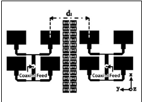

# DUAL-MONOPOLE-ANTENNA-WITH-EBG-ARRAY-FOR-MUTUAL-COUPLING-REDUCTION
## Abstract
This project explores a technique to reduce mutual coupling in UWB MIMO antennas using a small-sized uniplanar EBG. The design features two circular monopole radiators with a ground plane slot for impedance matching. A 6.8 mm × 6.8 mm UC-EBG cell enhances isolation in a 4 × 1 array. The antenna, on a 1.6 mm FR4 substrate, exhibits -10 dB impedance bandwidths of 14.6 GHz (3-17.6 GHz) and 14.8 GHz (3.6-17.9 GHz) in simulation and measurement. UC-EBG achieves isolation better than -18 dB over the impedance bandwidth.
## Introduction
As data rates continue to increase, Ultra-wideband antennas (UWB) have become increasingly popular and widely accepted. They offer low power consumption, high data rates, and affordability, making them an excellent choice for high-speed wireless communication systems. UWB antennas are utilized in various applications, such as GPS, remote sensing, and Direct Broadcast System (DBS). The FCC has allocated a frequency range of 3.1–10.6 GHz for UWB systems, transmitting low-power signals over a vast bandwidth.

The most commonly used antenna for UWB systems is the microstrip antenna due to its planar and compact geometry, immunity to multi-path interferences, and near-omnidirectional radiation pattern. The omnidirectional radiation pattern enables freedom in the orientation of transmitter and receiver antennas, ensuring reliable communication.

To increase system capacity, the high bandwidth of UWB antennas can be efficiently utilized by employing Multiple-Input Multiple-Output (MIMO) antennas. MIMO antennas use multiple antennas at the transmitter and receiver sides to counter the effects of multipath fading, improving link reliability and spectral efficiency. MIMO antennas transmit power using multiple antennas at the transmitter, supporting high data rates and increased channel capacity without sacrificing additional power. Several configurations have been proposed in the literature for realizing MIMO antennas.

UWB MIMO antennas are highly desirable for portable devices supporting various wireless telecom standards and services. In close proximity, MIMO antenna elements can affect each other through near-field coupling, significantly affecting system performance, especially in the lower UWB band. The inter-element spacing is optimal to reduce coupling effects, posing a minimum limit on the antenna size. Decoupling structures are desired between the radiators to maintain optimum performance and reduce inter-element spacing.

Researchers have proposed several techniques to increase decoupling between elements, such as defected ground structure (DGS), neutralization lines, stubs, decoupling and matching networks, parasitic structures, electromagnetic band gap (EBG) structures as a decoupling array, or EBG as a substrate. Compact MIMO antennas achieving wideband isolation have been demonstrated using tree-like structures, meandered lines, and orthogonal radiation modes. A compact double-sided UWB MIMO antenna has achieved isolation by decoupling structures. EBG structures can be mushroom-like or uniplanar, and their use has been shown to reduce E-plane coupling. UC-EBG super states have also been demonstrated for reducing mutual coupling in patch antenna arrays.

### Objective
This project presents a method for reducing mutual coupling between elements of a UWB MIMO antenna using a small-sized uniplanar EBG. The proposed UWB antenna design includes two circular-shaped monopole radiators with a ground plane slot for proper impedance matching. A 6.8 mm × 6.8 mm UC-EBG cell is inserted between the antenna elements in a 4 × 1 array configuration to improve isolation. The UCEBG's band gap is determined using dispersion diagrams and suspended strip line methods. The antenna is fabricated on a 1.6 mm thick, low-cost FR4 substrate with an overall size of 27.2 mm × 46 mm and has been experimentally verified. The antenna demonstrates simulated and measured -10 dB impedance bandwidths of 14.6 GHz (3-17.6 GHz) and 14.8 GHz (3.6-17.9 GHz), respectively. The UCEBG structure exhibits multiple stop bands and suppresses E-plane coupling over these bands, achieving isolation better than -18 dB over the complete impedance bandwidth. The radiation efficiency and peak gain of the antenna vary from 78% to 96.7% and 1.4 dB to 4 dB, respectively. MIMO parameters such as error correlation coefficient (ECC) better than 0.018 and Total active reflection coefficient (TARC) better than -26 dB are achieved over the impedance bandwidth.

## Existing System

### Mutual Coupling reduction using 2D-EBG Array structure
Reducing mutual coupling is a key research area in the design of compact microstrip antenna arrays. To minimize the overall size of the antennas arrays, the distance between them must be very small, as a result, strong mutual coupling appears. Periodic structures can help to design a low profile of antennas arrays and enable improving their performances by the suppression of surface waves propagation in a given frequency range. This paper proposes a novel configuration of mushroom-like electromagnetic band-gap (2D-EBG) structure created by microstrip technology placed between two antennas arrays to reduce the mutual coupling by more than -33.24 dB. When 13×2 EBG structures are used, the mutual coupling reduces to -59.36 dB at the operation frequency 5.8 GHz of the antennas arrays. A 26.12 dB mutual coupling reduction is achieved, proving that the surface wave is suppressed.

### Mutual Coupling Reduction using UC-EBG Array
The fast development in electromagnetic band-gap (EBG) structures; various configurations of EBG structures have been successfully applied in the patch antenna arrays to improve array characteristics, such as total size and radiation efficiency. Nowadays, an important challenge in the communication industry is to reduce the total size of devices. Placing elements of an antenna array close to each other is obviously one way to reduce the total size of an array; as a result, strong mutual coupling appears. Some conventional structures have also been proposed to reduce the mutual coupling between the radiating elements of microstrip antenna arrays such as cavity-backed and substrate removal microstrip antennas. The final results show a 10-dB reduction in mutual coupling and a 0.13 lambda reduction in size compared to the initial array structure.

### High Mutual Coupling Reduction using Novel structure
A novel parasitic configuration to reduce the mutual coupling between two adjacent microstrip patch antennas is shown that mutual coupling between the antenna elements can be reduced significantly by two simple slots structure on the ground plane and several shorted simple conducting strips between patch antennas. The results are shown that more than 7 dB reduction within the operational frequency bandwidth with the maximum 41 dB mutual coupling at the center frequency can be achieved and proves the high efficiency of this configuration in multi-antenna systems.

## Proposed System

### Reference Antenna
The geometry of the antenna without UC-EBG and the proposed UWB MIMO antenna are shown in Figs. 5.2, 5.3, and 5.4 respectively. The proposed UWB MIMO antenna is printed on a 27.2 mm × 46 mm × 1.6 mm FR4 substrate with relative permittivity \( \epsilon_r = 4.4 \) and a loss tangent of 0.02. A 3 mm wide, 50 Ω microstrip line is used for feeding the identical UWB antenna elements. The lower edge frequency of the circular monopole antenna can be approximated by the following equations:

\[ f_{\text{edge}} = \frac{7 \cdot 2}{\lambda \left( L + M + \frac{L_f}{\lambda_g} \right) \sqrt{G H_z}} \]

Width of the microstrip line used to feed the monopole antenna is calculated for 50 Ω impedance and is 3 mm. \( L \) is the effective radius of the monopole antenna in cm, \( M \) is the effective radius of the cylindrical monopole antenna in cm, \( L_f \) is the length of the feed line in cm, and \( \lambda_g \) is the wavelength in the microstrip line. The \( k \) factor is equivalent to \( \epsilon_{\text{eff}} \). For a 0.16 mm thick FR4 substrate with a permittivity of 4.4, \( k = 1.15 \) and estimates the lower edge frequency with an accuracy of ± 10%. For the circular monopole radiator \( L = 2r \) and \( M = r/4 \), where \( r \) is the radius of the circular monopole radiator. The computed lower cut-off frequency of the antenna is 3.1 GHz. The UWB MIMO antenna is realized using circular monopole radiators with a radius of 6.5 mm.

### Proposed Antenna
The geometry of the antenna without UC-EBG and the proposed UWB MIMO antenna are shown in Figs. 5.2, 5.3, and 5.4 respectively. The proposed UWB MIMO antenna is printed on a 27.2 mm × 46 mm × 1.6 mm FR4 substrate with relative permittivity \( \epsilon_r = 4.4 \) and a loss tangent of 0.02. A 3 mm wide, 50 Ω microstrip line is used for feeding the identical UWB antenna elements.

The performance of MIMO antennas can be severely impacted by the excitation of surface waves, which is caused by low inter-element spacing between adjacent antenna elements. To address this issue and maintain a small antenna size, a decoupling structure is necessary. The UC-EBG structure is effective in suppressing unwanted surface waves in the E-plane. However, conventional EBG structures tend to be large, limiting their application in MIMO antennas, as they restrict the minimum spacing between antenna elements. Additionally, conventional UC-EBG structures exhibit narrow stop bands.

To overcome these limitations, a new design has been proposed that utilizes a smaller UC-EBG array to efficiently reduce mutual coupling over the entire UWB range. The effectiveness of this new design as a decoupling structure has been demonstrated through an analysis of the current distribution on the antenna. When the UC-EBG array is inserted between the elements, the current coupling to Port2 is significantly reduced. Additionally, a high current density on the EBG elements is observed. These results suggest that the UC-EBG reduces the coupling current flowing between ports, thereby improving the performance of the MIMO antenna.

## Project Methodology

### EBG Array
A new uniplanar electromagnetic bandgap (EBG) structure has been designed on an FR4 substrate with a thickness of 1.6 mm and a relative permittivity of \( \epsilon_r = 4.4 \). The unit cell of the structure has a size of 6.8 mm × 6.8 mm and is created by modifying a conventional square patch and connecting adjacent cells with thin meandered microstrip lines as bridges.

This new geometry of the EBG structure can be represented as a parallel combination of a lumped equivalent inductor and capacitor, as long as the periodicity is much smaller than the operating wavelength. The capacitance is achieved through the thin gaps between the metallic patches, while the inductance is generated by the current flowing through the thin microstrip lines. To achieve a wide band gap, the equivalent inductance and capacitance of the structure need to be increased. The meandering of the lines also increases the inductance and widens the relative bandwidth of the EBG structure. The center frequency of the band gap of EBG can be determined by:

\[ \omega = \frac{1}{\sqrt{LC}} \]

Electromagnetic bandgap structures have specific stop bands where the propagation of electromagnetic waves is prohibited. The Eigen mode solver of the commercially available simulation tool HFSS has been used to compute the dispersion diagram of the proposed UC-EBG, utilizing periodic boundary conditions for an infinite EBG array. The suspended strip line method has been employed to calculate the transmission characteristics of the UC-EBG geometry. This method involves using the UC-EBG structure as a ground plane with a 50 Ω microstrip line suspended over it. The stop bands are identified by the frequency band for which S21 is below −10 dB, indicating the prohibition of surface wave propagation.

### Antenna Geometry
The structure of the antenna without the UC-EBG and the newly proposed UWB MIMO antenna, respectively. The proposed UWB MIMO antenna is fabricated on an FR4 substrate with dimensions of 27.2 mm × 46 mm × 1.6 mm, which has a relative permittivity of 4.4 and a loss tangent of 0.02. The feeding of the identical UWB antenna elements is achieved through a 3 mm wide, 50 Ω microstrip line.

The lower edge frequency of the circular monopole antenna can be approximated by the following equations:

\[ f_{\text{edge}} = \frac{7 \cdot 2}{\lambda \left( L + M + \frac{L_f}{\lambda_g} \right) \sqrt{G H_z}} \]

The width of the microstrip line utilized to feed the monopole antenna has been computed for a 50 Ω impedance and measures 3 mm. The effective radius of the monopole antenna, denoted by \(L\), is measured in cm, while the effective radius of the cylindrical monopole antenna, denoted by \(M\), is also measured in cm. The length of the feed line is denoted by \(L_f\) and is measured in cm. The \(k\) factor is equivalent to \( \epsilon_{\text{eff}} \). In the case of a circular monopole radiator, \(L = 2r\) and \(M = r/4\), where \(r\) is the radius of the circular monopole radiator. The antenna's computed lower cut-off frequency is 3.1 GHz.

To realize the UWB MIMO antenna, circular monopole radiators with a radius of 6.5 mm are used. A rectangular slot is etched from the ground plane beneath the feed line to ensure proper impedance matching. An array of proposed UC-EBG, exhibiting multi-stop band, is inserted between the two antenna elements in a 4×1 configuration. The introduction of the EBG array modifies the response of the resultant antenna, which is optimized by reducing the length of the feed line and ground plane slot.

The rectangular slot located beneath the feed line serves as a parameter to attain the desired impedance matching over the UWB band. The effect of varying the slot length, denoted by \(L1\), on \(S11\). It is observed that the slot length's variation modifies the impedance bandwidth. A UWB response with \(S11 < −10 dB\) over the entire UWB band is obtained at \(L1 = 2.5 mm\). In comparison, the antenna without UC-EBG demonstrates a −10 dB impedance bandwidth of 11 GHz (3.1–14.1 GHz), whereas the proposed antenna, loaded with UC-EBG, exhibits a simulated bandwidth of 12 GHz (3–15 GHz). The UC-EBG attains multiple stop bands, enabling wideband decoupling.

**TABLE 5.1: Design parameters of the proposed antenna and UCEBG**
| Parameter | Value (mm) |
| --- | --- |
| \(L_s\) | 27.2 |
| \(L_\text{total}\) | 11.77 |
| \(L_g\) | 9.87 |
| \(r\) | 6.5 |
| \(t\) | 1.6 |
| \(L_s\) | 6.6 |
| \(w_0\) | 46 |
| \(L_g\) | 7.6 |
| \(L_1\) | 2.5 |
| \(L_2\) | 3.4 |
| \(L_g\) | 6.8 |
| \(A\) | 0.2 |
| \(w_s\) | 26 |
| \(w_g\) | 3 |
| \(w_1\) | 6.8 |
| \(b\) | 0.2 |

### Partial Ground
A partial ground element is often used in antenna designs to improve the antenna's performance. The purpose of the partial ground element is to modify the current distribution on the antenna, which in turn affects the radiation pattern and impedance of the antenna.

By adding a partial ground element, the antenna's radiation pattern can be shaped in a more desired way. This can help to reduce unwanted radiation in certain directions or increase the antenna's gain in other directions. The partial ground element can also help to increase the antenna's bandwidth by modifying the antenna's impedance.

Another benefit of using a partial ground element is that it can help to reduce the size of the antenna. By adding a ground plane beneath the antenna, the overall size of the antenna can be reduced, making it more practical for use in compact devices. Overall, the purpose of using a partial ground element in antenna design is to improve the antenna's performance in terms of radiation pattern, impedance, bandwidth, and size.

### Tool Kit
ANSYS HFSS is 3D electromagnetic (EM) simulation software for designing and simulating high-frequency electronic products such as antennas, antenna arrays, RF or microwave components, high-speed interconnects, filters, connectors, IC packages, and printed circuit boards. Engineers worldwide use Ansys HFSS software to design high-frequency, high-speed electronics found in communications systems, advanced driver assistance systems (ADAS), satellites, and internet-of-things (IOT) products.

ANSYS Electronics Desktop Student offers free access to the industry gold-standard Ansys simulators for work with antenna, RF, microwave, PCB, IC, and IC package designs, along with electromechanical devices such as electric motors and generators. Students will have access to Ansys HFSS, Ansys Maxwell, Ansys Q3D, and Ansys Icepak, allowing design work on a broad range of electrical and electromechanical systems.

Ansys HFSS is multipurpose, full-wave 3D electromagnetic (EM) simulation software. Ansys Maxwell is a 3D electromagnetic simulation solver for electric machines and electromechanical devices. Ansys Q3D Extractor calculates the parasitic parameters of resistance, inductance, capacitance, and conductance (RLCG) for electronics designs. Ansys Icepak is a computational fluid dynamics (CFD) solver for electronics thermal management.

## Result and Discussion

### S – Parameter
To validate the performance of the proposed antenna and UC-EBG array, the measured and simulated return loss plot (S11) of the antenna, with and without the UC-EBG structure, are presented in Figure 6.1. The antenna without UC-EBG demonstrated a measured −10 dB impedance bandwidth of 11 GHz (3.1–14.1 GHz), while the antenna loaded with UC-EBG showed a broader bandwidth of 12 GHz (3.6–15 GHz). The simulated and measured results were in good agreement.

It is evident that the UC-EBG increased the isolation and reduced the mutual coupling between the UWB antenna elements in the frequency bands that corresponded with the stop bands of the UC-EBG structure. However, the UC-EBG was not able to effectively suppress surface waves at certain frequencies due to the excitation of spurious signals. This was attributed to several factors, including fabrication tolerances, excitation of higher-order modes, non-ideal measurement environments, and variations in permittivity and loss tangent of commercially available substrate, which can impact antenna performance, especially at higher frequencies.

### VSWR
The level of reflected and incident waves is used to determine the Voltage Standing Wave Ratio (VSWR). The Voltage Standing Wave Ratio of different patch materials proves that graphite has a low VSWR when compared to the other two because the deepest curve has the better VSWR.

### Radiation Pattern
The simulated and measured 2-D radiation patterns of the proposed UWB MIMO antenna at various frequencies ranging from 4.5 GHz to 16 GHz in the xz-, yz-, and xy-planes. The radiation pattern shows an omni-directional shape that is similar to that of a monopole antenna. However, at high frequencies, ripples are observed in the radiation pattern, which may be attributed to the generation of higher-order modes. The measured results closely match the simulated results, although discrepancies may arise due to fabrication errors, measurement uncertainty, and the high loss tangent of the substrate.

## Conclusion

This study showcases the reduction of mutual interference between elements of an Ultra-Wideband Multiple-Input Multiple-Output (UWB MIMO) antenna by utilizing a UC-EBG structure that has four stop bands. The UC-EBG array is arranged in a 4 x 1 configuration and placed between the MIMO elements. The UC-EBG stops the propagation of surface waves within its stop band, which results in isolation. The proposed antenna has an impedance bandwidth of 14.8 GHz, with a measured -10 dB bandwidth. The isolation is better than -18 dB throughout the entire impedance bandwidth. The antenna also has a very low envelope correlation coefficient, with a maximum value of 0.018 over the impedance bandwidth, and achieves diversity gain close to 10.

